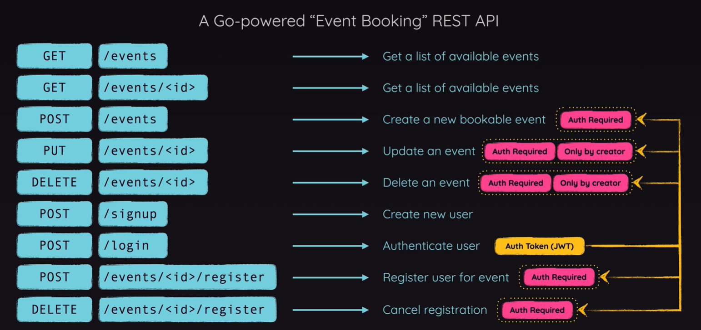

# Project REST API

This is a REST API project built with [Go](https://golang.org/) that provides endpoints for managing events. I made this project to learn more about Go and its ecosystem, and it is part of the [Go - The Complete Guide](https://www.udemy.com/course/go-the-complete-guide) course on Udemy.

## Endpoints

- `GET /events`: Get all events
- `GET /events/{id}`: Get an event by ID
- `POST /events`: Create a new event
- `PUT /events/{id}`: Update an event by ID
- `DELETE /events/{id}`: Delete an event by ID
- `POST /signup`: Create a new user
- `POST /login`: Login with an existing user
- `POST /events/{id}/register`: Register a user to an event
- `DELETE /events/{id}/register`: Unregister a user from an event

## Technologies

- [Go](https://golang.org/)
- [Gin](https://github.com/gin-gonic/gin)
- [SQLite](https://pkg.go.dev/modernc.org/sqlite)

## Running the project

1. Clone the repository
2. Run the following command to start the server: `go run .`
3. The server will start at `http://localhost:8080`
4. You can test the endpoints using the contents from the `/http` folder, that can be run with the [REST Client extension](https://marketplace.visualstudio.com/items?itemName=humao.rest-client) or even with other tool like [Postman](https://www.postman.com/) or [Insomnia](https://insomnia.rest/)
